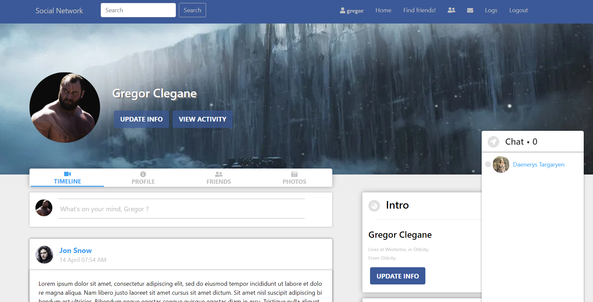
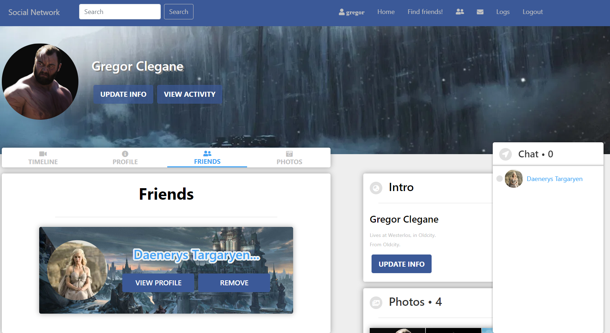
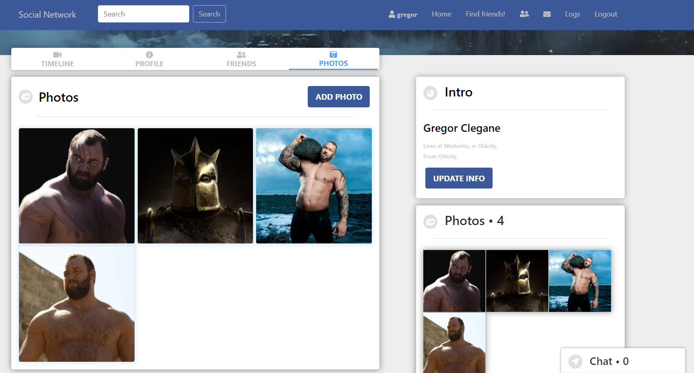

# DevConnect | Full-Stack Social Networking Platform

DevConnect is a full-stack social networking web application engineered to support real-time social interactions, secure user authentication, dynamic feeds, and vedio sharing.

## 🚀 Tech Stack
* **Frontend:** React.js, JavaScript, HTML5, CSS3
* **Backend:** Java, Spring Boot, RESTful APIs
* **Database:** MySQL
* **Cloud & Media:** Cloudinary API (Image & Media Storage)
* **Version Control & Tools:** Git, GitHub, Maven

## ✨ Key Features
* **User Authentication & Authorization:** Secure login, registration, and session handling.
* **Dynamic Feed Rendering:** Real-time social feed displaying posts, likes, and comments from connected users.
* **Social Graph Management:** Send, accept, and manage friend requests and user networks.
* **Cloud Media Processing:** Integrated Cloudinary API for optimized image storage and rendering.
* **Responsive UI/UX:** Built with React for a seamless single-page application (SPA) experience across devices.

## 📸 App Screenshots

### Home Feed


### Friends Network


### Media & Photos


---
## 🛠️ Local Setup Instructions

### 1. Database Configuration
1. Create a MySQL database named `social_network_db`.
2. Update your Spring Boot application properties (`src/main/resources/application.properties`) with your local MySQL credentials.

### 2. Backend Setup (Spring Boot)
```bash
# Navigate to the backend directory and run:
mvn spring-boot:run

### 3. Frontend Setup (React)
```bash
# Navigate to the frontend directory, install dependencies, and start:
npm install
npm start

